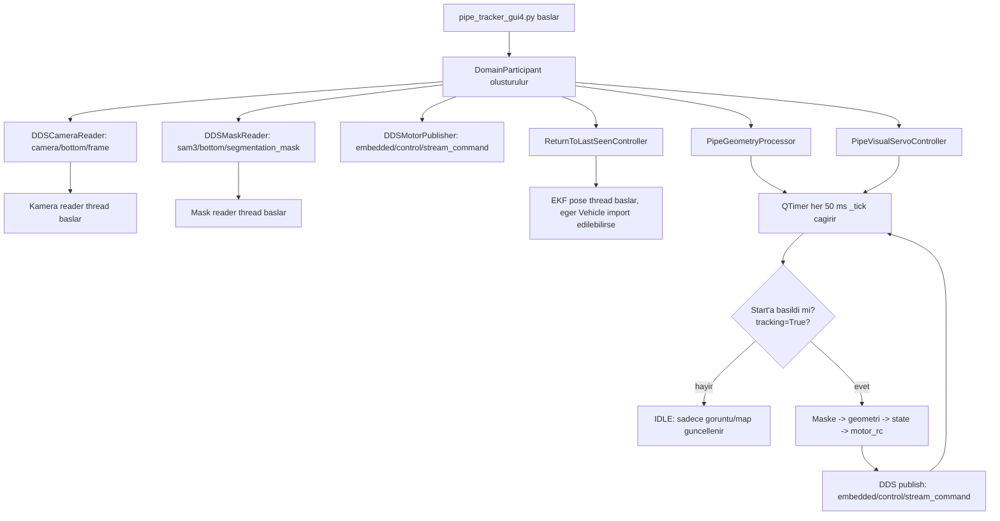
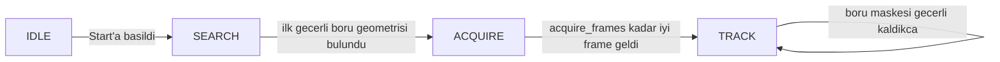
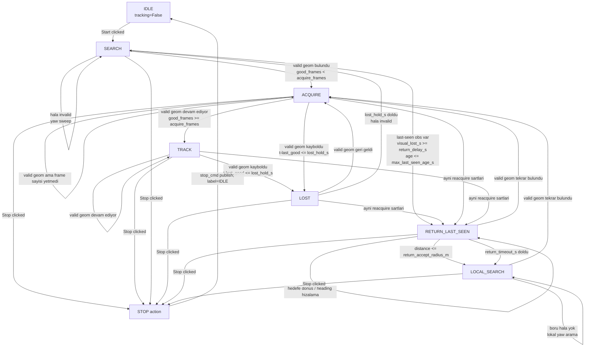
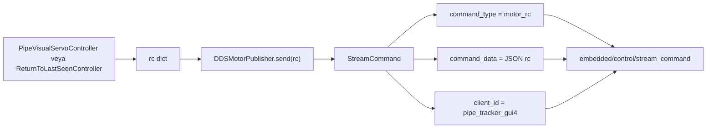

# Pipe Tracker GUI v4 - Duz Boru Takip Akisi

Bu dosya, duz boru hattini `pipe_tracker_gui4.py` ile basarili takip ettigin akisi anlatir.
Ana odak GUI v4'tur. `tauv-pipe` icindeki Docker / `main.py` yolu ayri ve daha eski/headless
akis olarak duruyor; senin anlattigin basarili takip yolu `pipe_tracker_gui4.py` tarafidir.

## Hangi Dosyalara Gore Hazirlandi

Ana calisan yol:

- `pipe_tracker_gui4.py`: GUI v4, Start/Stop butonlari, DDS topic baglantilari, 50 ms kontrol tick'i.
- `pipe_tracker_dds.py`: `camera/bottom/frame`, `sam3/bottom/segmentation_mask`, `embedded/control/stream_command` DDS okuma/yazma siniflari.
- `pipe_algorithm.py`: `PipeGeometryProcessor` ve `PipeVisualServoController`; maskeden boru geometrisi ve motor komutu uretir.
- `pipe_reacquire.py`: boru kaybolunca EKF pose ile son gorulen noktaya donme ve lokal arama.

Ikincil / karistirmamak gereken yol:

- `main.py`, `dds_interface.py`, `docker-compose.yaml`, `entrypoint.sh`, `config.yaml`: headless/Docker akisi. Bu yol `PipeController` ile daha eski `FOLLOW / NO_PIPE` mantigini kullanir. GUI v4'teki `SEARCH / ACQUIRE / TRACK / LOST / RETURN_LAST_SEEN / LOCAL_SEARCH` state'leri buradan gelmez.

Not:

- Kodda `tauvguiv4` diye bir dosya adi yok; bu dokumanda kastedilen calisan GUI `pipe_tracker_gui4.py`.
- `Detecting` diye state sabiti yok. Kodda bunun karsiligi `ACQUIRE`.
- `Tracking` kodda `TRACK`.
- `Reacquire` tek bir state degil; `RETURN_LAST_SEEN` ve `LOCAL_SEARCH` olarak iki parca.
- `Stop` kalici state degil; Stop butonuna basilinca yayinlanan bir durdurma action'i.

## Sensor ve Veri Kaynaklari

| Kaynak | Kodda nerede | Topic/API | Gelen veri | Ne icin kullaniliyor |
|---|---|---|---|---|
| Alt kamera frame | `DDSCameraReader` | `camera/bottom/frame` | `FrameChunk`: `timestamp`, `chunk_buffer`, `width`, `height`, `encoding` | Ekranda goruntu gostermek, maskeyi frame ile eslemek, ArUco debug. Normal boru kontrolunun ana girdisi maske. |
| SAM3 segmentation mask | `DDSMaskReader` | `sam3/bottom/segmentation_mask` | `SegmentationMask`: `timestamp`, `camera`, `width`, `height`, `mask_data` | Ana takip girdisi. Boru maskesi buradan gelir. |
| EKF / arac pose | `Vehicle.state.snapshot` | tauv-client API | `x`, `y`, `depth`, `yaw`, `timestamp_ms`, `vx`, `vy`, stale flag'leri | Harita, last-seen kaydi ve reacquire. Duz boru normal `TRACK` icin zorunlu degil. |
| SAM3 prompt | `_send_prompt()` | `POST /api/prompt` | JSON: `camera=bottom`, `prompt=<text>` | SAM3'e hangi nesneyi segmente edecegini soyler. |
| ArUco | `ArucoMarkerDetector` | kamera frame'i | marker ID ve okuma sirasi | Debug/gosterim. Pipe motor kontrolunu belirleyen ana veri degil. |
| Motor komutu | `DDSMotorPublisher` | `embedded/control/stream_command` | `StreamCommand(command_type="motor_rc", command_data=json(rc), client_id="pipe_tracker_gui4")` | Embedded/control tarafina PWM setpoint'leri gider. |

Motor komutu JSON alanlari:

- `pitch`
- `roll`
- `throttle`
- `yaw`
- `forward`
- `lateral`

GUI v4 duz boru takibinde asil komutlar `yaw`, `forward`, `lateral` uzerinden degisir. Digerleri neutral PWM civarinda kalir.

## Calisan GUI v4 Akisi



Basit anlatim:

1. GUI acildiginda DDS baglantilari kurulur.
2. Alt kamera frame'leri `camera/bottom/frame` topic'inden okunur.
3. SAM3 maskeleri `sam3/bottom/segmentation_mask` topic'inden okunur.
4. Start'a basana kadar GUI frame/mask gosterebilir ama takip komutu uretmez.
5. Start'a basinca `tracking=True` olur, controller resetlenir ve kontrol dongusu aktif hale gelir.
6. Her 50 ms'de `_tick()` calisir.
7. Gecerli boru maskesi varsa `PipeGeometryProcessor` boru merkezini ve acisini cikarir.
8. `PipeVisualServoController` bu hatalardan `yaw`, `forward`, `lateral` PWM komutu uretir.
9. Komut `embedded/control/stream_command` topic'ine `motor_rc` olarak yayinlanir.

## Kontrol Loop'u - Nereden Ne Aliyor, Nasil Yolluyor

```mermaid
flowchart LR
    CAM["Alt kamera frame<br/>camera/bottom/frame"] --> CR["DDSCameraReader"]
    CR --> CF["Frame buffer<br/>timestamp ile saklanir"]

    MASK["SAM3 mask<br/>sam3/bottom/segmentation_mask"] --> MR["DDSMaskReader"]
    MR --> MT["mask + mask timestamp"]
    MT --> NEW{"Yeni mask mi?"}
    NEW -->|"hayir"| CACHE["Eski annotation gosterilir"]
    NEW -->|"evet"| MATCH["Ayni timestamp'e yakin camera frame aranir"]
    CF --> MATCH
    MATCH --> BIN["Mask binary hale getirilir / gerekirse resize edilir"]
    BIN --> GEO["PipeGeometryProcessor.process"]
    GEO --> FEAT["Feature extraction:<br/>largest component, slice centroid, line fit"]
    FEAT --> ERR["Error calculation:<br/>lateral_error, lookahead_error, heading_error_deg, confidence"]
    ERR --> VALID{"Gecerli geometri mi?<br/>found && confidence >= min_confidence && stale degil"}

    VALID -->|"evet"| VSC["PipeVisualServoController.compute"]
    VSC --> CMD1["TRACK / ACQUIRE komutu:<br/>yaw + forward + lateral"]

    VALID -->|"hayir, last-seen uygun"| RET["ReturnToLastSeenController.update"]
    RET --> CMD2["RETURN_LAST_SEEN / LOCAL_SEARCH komutu"]

    VALID -->|"hayir, return yok"| SEARCH["PipeVisualServoController.compute(None)"]
    SEARCH --> CMD3["LOST veya SEARCH komutu"]

    CMD1 --> RC["motor_rc JSON"]
    CMD2 --> RC
    CMD3 --> RC
    RC --> PUB["DDSMotorPublisher.send"]
    PUB --> OUT["embedded/control/stream_command"]
```



Detayli veri isleme:

- `DDSMaskReader` maskenin `width * height` boyutunu kontrol eder, `mask_data` byte dizisini `numpy` maskesine cevirir.
- `_tick()` yeni maskenin timestamp'ini onceki islenen timestamp ile karsilastirir. Ayni maskeyi tekrar process etmez.
- Frame bulunursa maskeyi frame boyutuna resize eder ve overlay cizer. Frame bulunmazsa mask-only modda yine geometri cikarabilir.
- `PipeGeometryProcessor` motor komutu uretmez. Sadece goruntu uzayinda boru geometrisi ve hata olcumleri uretir.
- `PipeVisualServoController` motor komutunu uretir.
- `DDSMotorPublisher` komutu `StreamCommand` olarak yayinlar.

## Duz Boru Takibinde Normal State Sirasi

Senin basarili takip ettigin duz boru senaryosunda beklenen state yolu:



Bu durumda sistemin uzun sure kalmasi gereken state `TRACK`tir. Duz boru net goruluyorsa `LOST`, `RETURN_LAST_SEEN`, `LOCAL_SEARCH` gibi state'lere gecmemesi beklenir.

## Tum GUI v4 State'leri



### IDLE

`tracking=False` durumudur.

Ne olur:

- GUI kamera/maskeyi gosterebilir.
- Harita ve bilgi label'lari guncellenebilir.
- Normal `_tick()` icinde motor komutu yayinlanmaz.
- Stop'a basilinca ayrica `stop_cmd()` yayinlanir ve state label `IDLE` olur.

Nereden gelir:

- Program ilk acildiginda.
- Stop butonundan sonra.

Nereye gider:

- Start butonuna basilirsa `SEARCH` ile takip baslar.

### SEARCH

Boru gecerli olarak gorulmeyince veya Start'tan hemen sonra arama state'idir.

Ne olur:

- `PipeVisualServoController.compute(None)` calisir.
- `search_yaw_pwm` ile yaw saga/sola tarar.
- `search_switch_s` suresine gore yaw yonu degisir.
- Forward komutu `0` offset'tedir.

Nereden gelir:

- Start sonrasi controller resetlenince ilk state.
- `LOST` suresi bittikten sonra hala gecerli geometri yoksa.
- Hic gecerli boru gorulmemisse.

Nereye gider:

- Gecerli boru geometrisi bulunursa `ACQUIRE`.
- Last-seen ve EKF kosullari uygunsa `RETURN_LAST_SEEN`.

### ACQUIRE

Kodda `Detecting` yerine kullanilan state budur. Boru bulundu ama controller henuz tam takip moduna gecmek icin yeterli sayida iyi frame gormedi.

Ne olur:

- `geom.found=True` ve `confidence >= min_confidence`.
- `good_frames < acquire_frames`.
- Daha temkinli ileri PWM kullanilir: `acquire_forward_pwm` ile sinirlanir.
- `lateral_error`, `lookahead_error`, `heading_error_deg` yine hesaplanir ve komuta girer.

Nereden gelir:

- `SEARCH`, `LOST`, `RETURN_LAST_SEEN`, `LOCAL_SEARCH` sonrasi boru tekrar gecerli gorulurse.

Nereye gider:

- Yeterli iyi frame gelirse `TRACK`.
- Maske/geometri kaybolursa once `LOST`, sart uygunsa `RETURN_LAST_SEEN`.

### TRACK

Duz boru basarili takipte asil calisan state budur.

Ne olur:

- Boru geometrisi gecerli ve kararlidir.
- `lateral_error` arac sag/sol hizasini duzeltmek icin `lateral` kanalina gider.
- `heading_error_deg` ve `lookahead_error - lateral_error` yaw komutuna gider.
- `forward` hiz komutu, hata buyukse ve aci fazlaysa azaltilir.
- Komut her tick sonunda `embedded/control/stream_command` topic'ine yayinlanir.

Hesap ozeti:

- `lat = EMA(lateral_error)`
- `look = EMA(lookahead_error)`
- `angle = EMA(heading_error_deg)`
- `lateral_offset = lateral_sign * kp_lateral * lat`
- `yaw_offset = yaw_sign * (kp_yaw_angle * angle + kp_yaw_lookahead * (look - lat))`
- `forward` = `base_forward_pwm * speed_scale * confidence etkisi`

Duz boruda beklenen:

- `lateral_error` merkeze yakinsa `lateral` offset kucuk kalir.
- `heading_error_deg` kucukse `yaw` offset kucuk kalir.
- `confidence` iyi oldugu icin `forward` daha kararli gider.

### LOST

Boru yeni kaybolduysa kisa sureli gecici state.

Ne olur:

- `valid geom` yoktur.
- Ama son iyi gorus `lost_hold_s` suresi icindedir.
- Eski `yaw` ve `lateral` komutlari %35'e dusurulerek yumusak tutulur.
- `lost_forward_pwm` kullanilir; default `0`.

Nereden gelir:

- `TRACK` veya `ACQUIRE` sirasinda maske/geometri kisa sure kaybolursa.

Nereye gider:

- Boru geri gelirse `ACQUIRE`.
- `lost_hold_s` dolarsa ve boru hala yoksa `SEARCH`.
- Last-seen/EKF kosullari uygunsa `RETURN_LAST_SEEN` yolu devreye girebilir.

### RETURN_LAST_SEEN

Bu reacquire akisinin ilk parcasidir. Normal duz boru takipte devreye girmemesi beklenir; boru kaybolursa kullanilir.

Ne gerekir:

- Gecerli boru geometrisi artik yok.
- Daha once kaydedilmis last-seen observation var.
- `visual_lost_s >= return_delay_s`.
- Last-seen observation yasi `max_last_seen_age_s` limitinden kucuk.
- EKF pose usable ise hedefe gitme komutu anlamli olur.

Ne yapar:

- Son guvenilir boru gorulen zamandaki EKF pose hedef secilir.
- Aracin mevcut `x/y/yaw` pose'u ile hedef arasindaki mesafe ve heading error hesaplanir.
- Heading farki buyukse once yaw hizalama yapar.
- Hizalaninca forward ve lateral PWM ile hedefe gitmeye calisir.
- Reacquire sirasinda gerekirse `Vehicle.set_target_attitude(yaw_deg)` de cagrilir.

Nereye gider:

- Hedef mesafesi `return_accept_radius_m` altina inerse `LOCAL_SEARCH`.
- `return_timeout_s` dolarsa `LOCAL_SEARCH`.
- Boru tekrar gorulurse normal visual servo resetlenir ve `ACQUIRE/TRACK` yoluna doner.

### LOCAL_SEARCH

Reacquire akisinin ikinci parcasidir. Son gorulen noktaya gelindi ama boru hala bulunamadiysa lokal yaw arar.

Ne olur:

- Forward/lateral yerine temel olarak yaw aramasi yapar.
- `local_search_yaw_pwm` kadar saga/sola yaw verir.
- `local_search_switch_s` ile yon degistirir.

Nereye gider:

- Boru tekrar gecerli gorulurse `ACQUIRE`, sonra `TRACK`.
- Boru gorulmezse lokal aramaya devam eder.

### STOP action

Kalici state degildir.

Ne olur:

- Stop butonuna basilir.
- `tracking=False`.
- `ReturnToLastSeenController.reset()`.
- `PipeVisualServoController.stop_cmd()` yayinlanir.
- `state_label` tekrar `IDLE` olur.

## Geometri Nasil Cikariliyor

`PipeGeometryProcessor` maskeden su bilgileri cikarir:

1. Maskeyi binary hale getirir.
2. Morfolojik temizlik yapar.
3. En buyuk component'i secer.
4. Component alani cok kucukse gecersiz sayar.
5. Slice centroid'leri cikarir.
6. Slice noktalarina line fit yapar.
7. Borunun merkez ve lookahead noktalarini hesaplar.
8. Hata degerlerini uretir.

Uretilen ana hata degerleri:

- `lateral_error`: boru merkezi goruntude sag/sol ne kadar kayik. Pozitifse boru goruntude sagda.
- `lookahead_error`: borunun ileri tarafindaki lookahead noktasinin sag/sol hatasi.
- `heading_error_deg`: borunun ileri ucunun acisal yonu. Pozitifse ileri uc goruntude saga dogru.
- `confidence`: slice sayisi, alan ve elongation skorlarindan uretilen guven skoru.

Gecerli geometri sarti:

- `geom is not None`
- `geom.found == True`
- `geom.confidence >= min_confidence`
- son geometri yasi `mask_stale_s` suresinden kucuk

## Komut Nasil Yollaniyor



Ornek komut sekli:

```json
{
  "pitch": 1500,
  "roll": 1500,
  "throttle": 1500,
  "yaw": 1508,
  "forward": 1580,
  "lateral": 1492
}
```

Bu degerler ornektir. Kodda neutral PWM `1500`; controller offset hesaplar ve neutral uzerine ekler.

## Duz Boru Takibinde Ne Kontrol Edilmeli

Basarili duz boru takibinde GUI'de beklenen:

- State bir sure sonra `TRACK`.
- `geom.reason=ok`.
- `confidence` yeterli.
- `lateral_error` cok buyuk degil.
- `heading_error_deg` duz boruda cok buyuk degil.
- `mask_fps` akiyor.
- `embedded/control/stream_command` uzerinden `motor_rc` yayinlaniyor.

Eger state `SEARCH`'te kaliyorsa:

- SAM3 mask gelmiyor olabilir.
- Mask var ama `confidence < min_confidence` olabilir.
- Mask timestamp eski olabilir ve `mask_stale_s` yuzunden kontrol disi kalabilir.
- Topic adi farkli olabilir: GUI v4 kodu `sam3/bottom/segmentation_mask` bekliyor.

Eger `LOST` / `RETURN_LAST_SEEN` goruluyorsa:

- Boru kisa sureligine kaybolmustur veya maske guveni dusmustur.
- `RETURN_LAST_SEEN` icin EKF pose gerekir.
- `Seen max age` / `max_last_seen_age_s`: son gorulen boru bilgisinin bayat sayilma siniri.
- `Return timeout` / `return_timeout_s`: hedefe donmeyi ne kadar surdurdugu.

## Docker / Headless Notu

`tauv-pipe` icinde Docker ve `main.py` akisi duruyor, ama bu GUI v4 ile yaptigin basarili takipten farkli.

Headless `main.py` yolu:

- Sadece mask subscriber kullanir.
- `MaskProcessor -> PipeController` akisini kullanir.
- Aktif state mantigi `FOLLOW / NO_PIPE`.
- Kamera frame'i dogrudan okumaz.
- GUI v4'teki map, EKF reacquire, `TRACK / ACQUIRE / LOST / SEARCH` visual-servo akisi burada yoktur.

Bu yuzden duz boru hattini `pipe_tracker_gui4.py` ile takip ederken asil bakman gereken dosyalar:

- `pipe_tracker_gui4.py`
- `pipe_tracker_dds.py`
- `pipe_algorithm.py`
- `pipe_reacquire.py`

